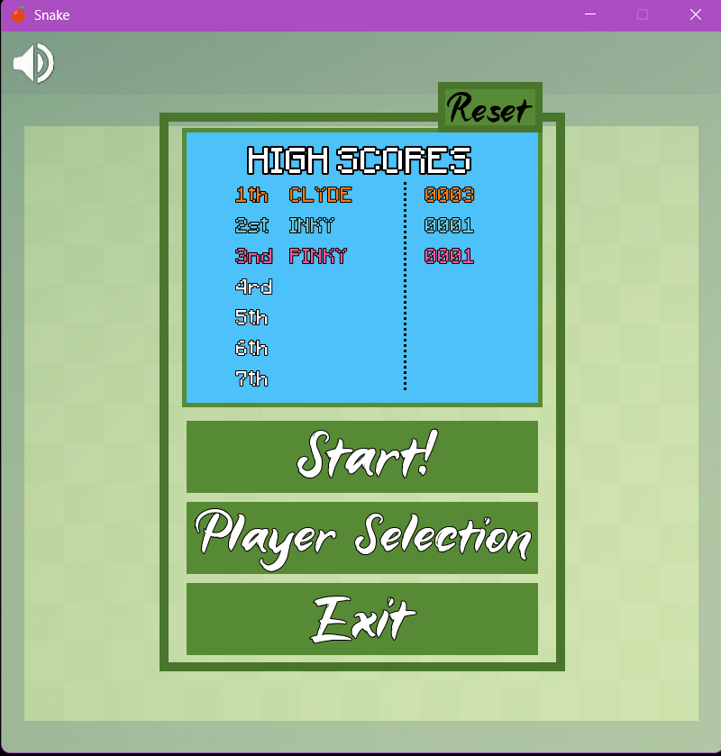
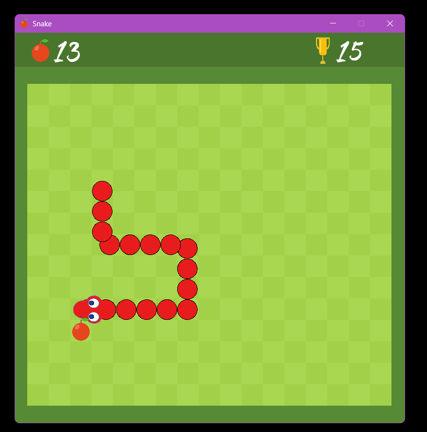
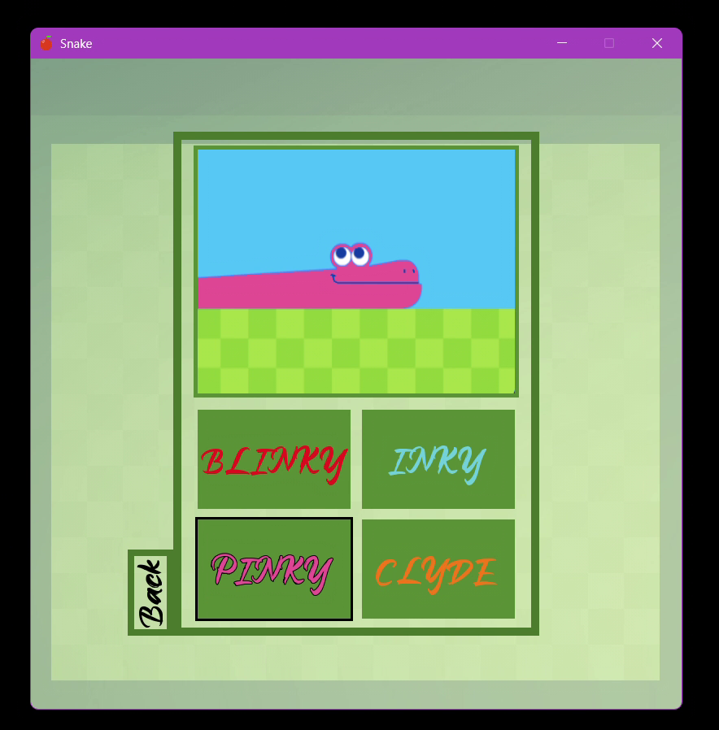

# Snake Game

## 🎮 pics

  
  

## 🐍 info

Me + Colin made a snake game based on Google's snake game.  
“Most visual assets were borrowed from other games for learning purposes. I do not claim ownership over them.” 
But I did get the audio from Colin so I didn’t steal that.

---

## 🧰 Stuff about the project

- Code mostly uses **snake_case** as the naming convention  
- Written in **C++**  
- Uses **SFML** as the multimedia library  
- Made in **Visual Studio**

---

## 💭 Notes

I am aware that the snake movement could have been better.  
I decided to move the snake with velocities rather than basing it on tiles — I don't think it was a good decision.  
Also, due to a lack of Classes and lots of hard-coded stuff, the code is not very readable.  
I might improve upon these blemishes later.

---

## ⚠️ How to Play

**!!!!!! If you want to play the game just go to the [releases](../../releases) and download the executable !!!!!!!**

---

## 🎮 Game

- Arrow keys or WASD to move  
- Eat food to grow  
- Eat 200 apples to win  
- Don’t crash into yourself or the wall  
- You can play as different snakes to compete with others

---

## 🛠 Building from source

1. Make sure you have Visual Studio installed with C++ support.  
2. Clone this repo:  
   `https://github.com/Mason-code/Snake.git`  
3. Open the `.sln` file in Visual Studio.  
4. Make sure SFML is installed and linked correctly.  
5. Build and run the project.

---

## 📄 License

This project is for educational purposes only.  
I do not claim ownership of borrowed assets.  
Please do not use this commercially.

---

## 📬 Me

If you find any bugs or anything contact me at: 
**mason.neurauter@gmail.com**

